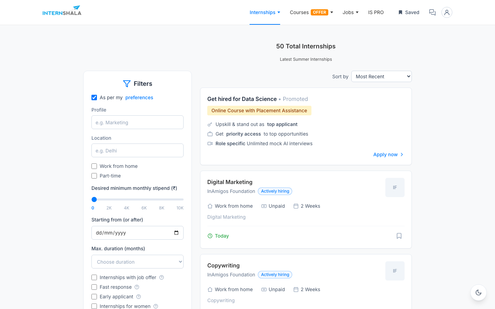

# Internshala Search

A fast, responsive internship search interface inspired by Internshala's listing
page. It pulls live data from Internshala's search endpoint, then does **all**
filtering, searching and sorting on the client — no extra network calls once the
page has loaded. Bookmarks and dark mode are persisted across refreshes.

> Built with Vite + React and Tailwind CSS. No UI component libraries — every
> component is hand-rolled.

## Screenshots



<!-- Tip: add a dark-mode capture (docs/dark.png) and a 375px mobile shot too. -->

## Features

- **Live data** fetched once on mount, then cached in state — every interaction
  after that is instant. It prefers Internshala's public listing page (parsed for
  its richer cards: real **skills**, **stipend ranges**, ~50 results) and falls
  back to the leaner `/hiring/search` JSON feed if that can't be parsed.
- **Keyword search** across role, company, city and skills, debounced by 300ms
  (hand-written, no lodash).
- **Composable client-side filters** laid out like Internshala's panel:
  - Profile & Location — autocomplete inputs that add removable chips (multi-select)
  - Work from home / Part-time toggles
  - Minimum monthly stipend — a 0–10K slider
  - Duration — 1–6 month checkboxes under "View more filters"
  - Keyword search lives inside the panel, debounced by 300ms (hand-written)
- **Active filter chips** above the results — click `×` to drop a single filter.
- **Sorting** by Most Recent or Stipend (high → low).
- **Bookmarks** that persist in `localStorage`, with a "Saved" toggle in the
  navbar to view only saved internships.
- **Dark mode** toggle that persists across refreshes and transitions smoothly.
  (Defaults to light so it matches Internshala out of the box.)
- **Three explicit data states**: skeleton loaders while fetching, an error
  state with a retry, and a friendly empty state when filters match nothing.
- **Responsive** from 375px up: single-column cards and a filter bottom sheet on
  mobile, a two-column grid on tablet, and a fixed filter sidebar on desktop.

## Tech stack

| Concern    | Choice                                  |
| ---------- | --------------------------------------- |
| Build tool | Vite 5                                  |
| UI         | React 18 (JSX + PropTypes)              |
| Styling    | Tailwind CSS v3 (class-based dark mode) |
| State      | `useState` + `useReducer` (no Redux)    |
| Data       | `fetch` (no axios)                      |
| Fonts      | Inter (Google Fonts)                    |

## Getting started

```bash
# 1. Install dependencies
npm install

# 2. Start the dev server (http://localhost:5173)
npm run dev
```

Other scripts:

```bash
npm run build     # production build into dist/
npm run preview   # preview the production build locally
npm run lint      # eslint (fails on warnings and console.log)
```

### Why the proxy?

Internshala's endpoints send no CORS headers, so the browser can't call them
directly. The client always fetches a relative `/api/*` path, which is proxied
to Internshala in two places:

- **Local dev** — the Vite dev-server proxy (`vite.config.js`). `followRedirects`
  is on so the occasional upstream 302 is resolved server-side.
- **Production (Vercel)** — the serverless function `api/[...path].js`, which
  forwards `/api/*` to Internshala and follows redirects the same way.

Both read the upstream origin from `INTERNSHALA_BASE_URL`, and the client base
path from `VITE_API_BASE_URL` (see **Environment variables** below).

### Environment variables

Copy `.env.example` to `.env` for local dev, and set the same values in your
Vercel project's **Settings → Environment Variables**:

| Variable | Default | Used by |
| -------- | ------- | ------- |
| `VITE_API_BASE_URL` | `/api` | client (build-time) — base path for requests |
| `INTERNSHALA_BASE_URL` | `https://internshala.com` | dev proxy + serverless function (server-side) |

Both have sensible defaults, so the app works without setting anything — the
variables are there for configurability.

## Project structure

```
src/
├── components/        # presentational + feature components (one job each)
│   ├── Navbar/        # logo, nav links, saved toggle, dark-mode toggle
│   ├── SearchBar/     # debounced keyword input
│   ├── FilterPanel/   # FilterPanel, AutocompleteFilter, StipendSlider,
│   │                  # ActiveFilterChips
│   ├── InternshipCard/# InternshipCard (+ initials fallback) & SkeletonCard
│   ├── InternshipList/# count, sort, windowed "Load more"
│   ├── BookmarkButton/
│   └── EmptyState/
├── hooks/
│   ├── useInternships.js  # fetch + normalise raw API data
│   ├── useFilters.js      # filter state (useReducer) + derived list
│   └── useBookmarks.js    # localStorage-backed bookmarks
├── utils/
│   ├── filters.js     # pure, composable filter functions
│   └── formatters.js  # stipend / duration / "posted ago" / initials
├── constants/
│   └── filterOptions.js   # ranges, options, keys, magic numbers
├── context/
│   └── ThemeContext.jsx   # dark-mode provider + useTheme hook
├── App.jsx            # orchestrator only — wires hooks to components
└── main.jsx
```

### A few design notes

- **One data layer, two sources.** `useInternships` first parses the public
  listing page (`utils/parseInternships.js`) for richer cards, and falls back to
  the JSON feed — both normalised into one tidy model the rest of the app uses.
- **Filtering is pure and testable.** `utils/filters.js` exports one function per
  filter plus `applyAllFilters`, composed inside `useFilters` and memoised so it
  only recomputes when the data or filters change.
- **Logos fall back gracefully.** Internshala blocks hotlinked logos, so a broken
  image swaps to a coloured initials avatar via an `onError` handler.
- **Performance:** the filtered list is memoised, prop handlers are wrapped in
  `useCallback`, cards are `React.memo`'d, images are lazy-loaded, and the list
  renders a window of results with a "Load more" button.

## Deploying

**Vercel (recommended)** — zero extra config:

1. Import the repo (framework preset: **Vite**).
2. The serverless function `api/[...path].js` automatically proxies `/api/*`
   to Internshala, so the production build loads data without CORS issues.
3. (Optional) Add the env vars from `.env.example` under
   **Settings → Environment Variables**.
4. Deploy.

**Other static hosts** — the client needs an equivalent `/api/*` → Internshala
proxy. On Netlify, for example:

```toml
# netlify.toml
[[redirects]]
  from = "/api/*"
  to = "https://internshala.com/:splat"
  status = 200
  force = true
```

Local production preview:

```bash
npm run build && npm run preview
```

## Notes & limitations

- Data is the first page Internshala currently serves (~50 listings) — no mock
  data is used anywhere.
- The reference UI also shows a one-line **internship description**. That text
  only appears on Internshala's logged-in, personalised page, so it isn't
  available from the public listing — those descriptions are intentionally
  omitted rather than fabricated.

<!-- Project bootstrapped with Vite + React on 2026-05-22 -->

<!-- FilterPanel: stipend range + duration checkboxes (2026-05-23) -->

<!-- useFilters refactored: useMemo applied to filter pipeline (2026-05-23) -->

<!-- Bookmark dedup fix: Set-based id comparison (2026-05-24) -->

<!-- README updated: setup steps, env vars, and screenshots section (2026-05-25) -->
